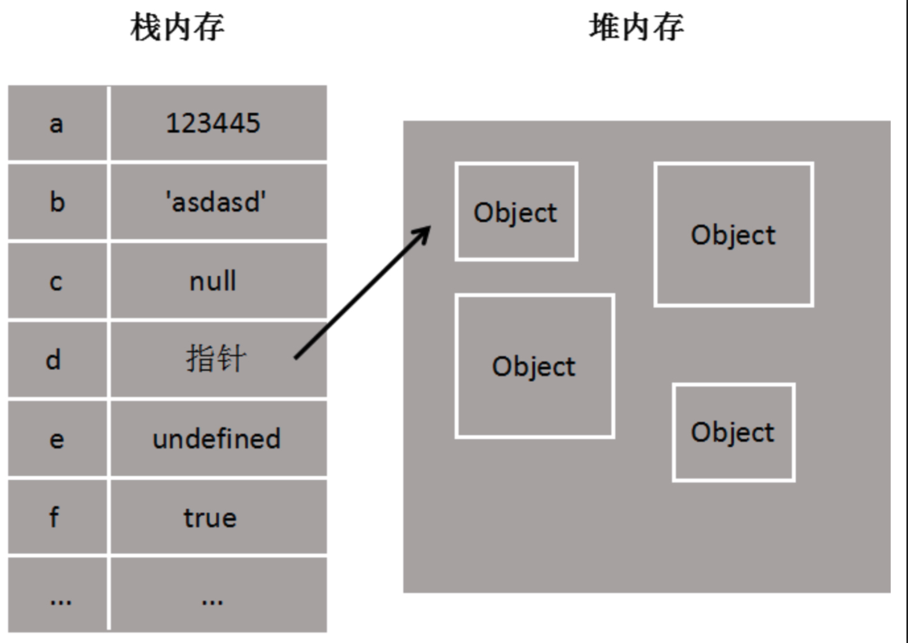

# 原始值与引用值

## 一、简介

|  | 原始值  | 引用值 |
| :----:| :----: | :----: |
| 别称 | 简单数据类型 | 复杂数据类型 |
| 数据类型 | undefined、null、boolean、 number、string、symbol | object |
| 存储位置 | <b><font color=red>栈</font></b>：存储在栈中的简单数据段，他们的值直接存储在变量访问的位置。 | <b><font color=red>堆</font></b>：存储在堆中的对象，存储在变量处的值是一个指针，指向存储对象的内存处。 |

> 注意：`typeof null`虽然是`object`，但是null依然是简单数据类型，并不是复杂数据类型\
> 原因：不同的对象在底层都表现为二进制，在`JavaScript`中二进制前三位都为 __0__ 的话，会被判断为 `object` 类型，而`null`的二进制全是 __0__，所以`typeof`返回的是`object`。
```js
null == undefined  // true

null === undefined // false
// 这两个都表示无，但是实际类型却不一样。
```

## 二、栈
[栈](https://www.yuque.com/hmohvc/smr5n4/mcpg7b)是一种<font color=red>后进先出</font>的数据结构。

## 三、堆
[堆](https://www.yuque.com/hmohvc/smr5n4/gqkinh)里面存的是复杂数据结构的值，指针存在栈内存中。

## 四、示意图


## 五、值的复制
原始值和引用值在通过变量复制时也有所不同，原始值会被复制到一个新的变量，而引用值实际上是复制了值的指针。示例
```js
let name = "zhangsan";
let myName = name;

console.log(myName); // "zhangsan"
```
> 当 myName 初始化为 name 时，“zhangsan”也会被复制到 myName 中，与 name 相互独立，互不干扰，可以理解为 myName 是 name 的副本。

引用值的复制，实际是复制了一个指针，指向堆内存中的对象，对复制后的变量进行属性操作，实际也是操作的被复制的对象，两个变量实际上是指同一对象。示例
```js
let me = new Object();
let you = me;

me.name = "lisi";

console.log(you.name); // "lisi"
```
