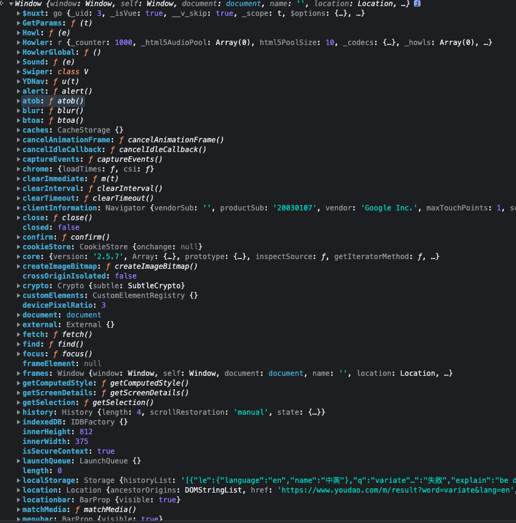

# 作用域与作用域链
## 一、作用域概念
作用域就是变量声明的区域，就是变量和函数的可访问范围（一个存放变量的独立空间）。
在JavaScript中，函数、块、模块都可以形成作用域。
```js
function outFun() {
    var inVariate = "内层变量2";
}
outFun(); //我们要先执行outFun函数，才能知道函数内部是什么
console.log(inVariate); // Uncaught ReferenceError: inVariate is not defined
```
上面例子我们可以看到作用域的概念，变量`inVariate`没有在全局作用域下声明，所以取值的时候会报错。其实作用域最大的好处就是隔离变量，不同作用域下的同名变量不会冲突。
## 二、全局作用域
在代码中任何地方都能访问到的对象拥有全局作用域，一般以下3种情形拥有全局作用域。
### 1. 最外层函数和在最外层函数外定义的变量拥有全局作用域
```js
var outVariate = "我是最外层变量"; //最外层变量
function outFun() { //最外层函数
    var inVariate = "内层变量";
    function innerFun() { //内层函数
        console.log(inVariate);
    }
    innerFun();
}
console.log(outVariate); //我是最外层变量
outFun(); //内层变量
console.log(inVariate); //inVariate is not defined
innerFun(); //innerFun is not defined
```
解析：`outFun`是最外层函数，在全局任何地方都能调用。`outVariate`是最外层变量，同样在全局下都能访问。
### 2. 所有未定义直接赋值的变量自动声明为拥有全局作用域
```js
function outFun2() {
    variable = "未定义直接赋值的变量";
    var inVariable2 = "内层变量2";
}
outFun2();//要先执行这个函数，否则根本不知道里面是啥
console.log(variable); //未定义直接赋值的变量
console.log(inVariable2); //inVariable2 is not defined
```
### 3. 所有window对象的属性拥有全局作用域
通常情况下，window对象的内置属性全部都拥有全局作用域，例如：`window.name`、`window.alert`、`window.location`等等。

> 缺点：如果我们写了很多代码，同时把变量全部定义在全局作用域下面（没有用函数包裹），这样就非常容易造成命名冲突，同时也污染了全局的命名空间
```js
// 张三的代码
var data = {name: '张三'}

// 李四的代码
var data = {age: 18};

**如果李四在写代码的时候，没有注意张三命名的data，也命名了data，那么就会把张三的data变量给覆盖，就会造成bug**
```

## 三、函数作用域
函数作用域是指声明在函数内部的变量，和全局作用域相反，函数作用域(局部作用域)一般只在固定的代码片段内可以访问到。
```js
function outFun(){
    var inVar ="我是outFun内部变量";
    function innerFun(){
        alert(inVar);
    }
    innerFun();
}
alert(inVar); // Uncaught ReferenceError: inVar is not defined
innerFun(); // Uncaught ReferenceError: innerFun is not defined
```
其实作用域是分层的，内层作用域可以访问外层作用域的变量，反过来就不行。
> 优点：不会污染全局命名空间，只要保证自己写的函数内没有重复变量就可以。
> 缺点：外面的作用域无法访问（如果想要访问，就要用到闭包）- 闭包将作为单独一篇进行讲解

:::tip
📢注意：块语句（大括号"{}"中间的语句）如果if和switch条件语句或者for和while循环语句，他们不会像函数一样创建一个新的作用域。
:::
```js
if (true) {
    // 'if' 条件语句块不会创建一个新的作用域
    var name = 'zhangsan'; // name 依然在全局作用域中
}
console.log(name); // logs 'zhangsan'
```
对于JS初学者而言，可能不太理解变量提升，然而在编写JS代码的时候，如果不理解这种特殊的行为，就很容易导致bug。所以在ES6就引入了块级作用域，让变量的生命周期更加可控。
:::tip
小贴士：ES5时代其实只有全局作用域和函数作用域，ES6之后才有了块级作用域。
:::
## 四、块级作用域
块级作用域可通过ES6中的let和const进行声明。let或者const声明的变量不能进行提升。

块级作用域在如下情形被创建：

1. 在一个函数内部
2. 在一个代码块（由一对花括号包裹）内部

let声明的语法和var基本一致，如果使用let进行声明，就会将变量的作用域限制在当前代码块中。

#### 块级作用域特点
> 1. 声明的变量不会提升到代码块顶部
let/const 声明并不会被提升到当前代码块的顶部，因此你需要手动将 let/const 声明放置到顶部，以便让变量在整个代码块内部可用。

```js
function getValue(condition) {
  if (condition) {
    let value = "blue";
    return value;
  } else {
    // value 在此处不可用
    return null;
  }
	// value 在此处不可用
}
```
> 2. 禁止重复声明
如果一个标识符已经在代码块内部被定义，那么在此代码块内使用同一个标识符进行 let 声明就会导致抛出错误。

```js
var num = 30;
let num = 40; // Uncaught SyntaxError: Identifier 'num' has already been declared
```

如果不在同一个作用域就不会报错

```js
var num = 30;
if (true) {
  let num = 40;
}
console.log(num) // 30
```
> 3. 循环中的妙用
```js
for (var i = 0; i < 10; i++) {
  // ...
}
console.log(i); // 10

for (let i = 0; i < 10; i++) {
  // ...
}
console.log(i);
// Uncaught ReferenceError: i is not defined
i只能在for循环内使用，不能在全局下使用。
```

```js
var a = [];
for (var i = 0; i < 10; i++) {
  a[i] = function () {
    console.log(i);
  };
}
a[6](); // 10
```

上面代码中，变量i是var命令声明的，在全局范围内都有效，所以全局只有一个变量i。每一次循环，变量i的值都会发生改变，而循环内被赋给数组a的函数内部的console.log(i)，里面的i指向的就是全局的i。也就是说，所有数组a的成员里面的i，指向的都是同一个i，导致运行时输出的是最后一轮的i的值，也就是 10。

如果使用let，声明的变量仅在块级作用域内有效，最后输出的是 6。

```js
var a = [];
for (let i = 0; i < 10; i++) {
  a[i] = function () {
    console.log(i);
  };
}
a[6](); // 6
```

上面代码中，变量i是let声明的，当前的i只在本轮循环有效，所以每一次循环的i其实都是一个新的变量，所以最后输出的是6。你可能会问，如果每一轮循环的变量i都是重新声明的，那它怎么知道上一轮循环的值，从而计算出本轮循环的值？这是因为 JavaScript 引擎内部会记住上一轮循环的值，初始化本轮的变量i时，就在上一轮循环的基础上进行计算。

## 五、作用域链概念

多个作用域对象连续引用形成的链式结构。

> <font color="red">使用方面</font>：当在Javascript中使用一个变量的时候，首先Javascript引擎会尝试在当前作用域下去寻找该变量，如果没找到，再到它的上层作用域寻找，以此类推直到找到该变量或是已经到了全局作用域，如果在全局作用域里仍然找不到该变量，它就会直接报错。这样一层层的查找就形成了<b>作用域链</b>。

> <font color="red">存储方面</font>：作用域链在JS内部中是以数组的形式存储的，数组的第一个索引对应的是函数本身的执行期上下文，也就是当前执行的代码所在环境的变量对象，下一个索引对应的空间存储的是该对象的外部执行环境，依次类推，一直到全局执行环境。

```js
var a = 100
function fun() {
    var b = 200
    console.log(a) //100
		// fun函数局部作用域中没有变量a，于是从它的上一级，也就是全局作用域中找，
		//在全局中a被赋值为100，于是输出100
    console.log(b)//200 fun函数局部作用域中有变量b，并且它被赋值为了200，输出200
}
fun()
```

## 六、作用域链延长
作用域链有多长主要看它当前嵌套的层数，但是有些语句可以在作用域链的前端临时增加一个变量对象，这个变量对象在代码执行完后移除，这就是作用域延长了。能够导致作用域延长的语句有两种:`try...catch`的catch块和`with`语句。
### 1. `try...catch`
这其实是我们一直在用的一个特殊情况:
```js
let x = 1;
try {
  x = x + y;
} catch(e) {
  console.log(e);
}
```
上述代码`try`里面我们用到了一个没有申明的变量`y`，所以会报错，然后走到`catch`，`catch`会往作用域链最前面添加一个变量`e`，这是当前的错误对象，我们可以通过这个变量来访问到错误对象，这其实就相当于作用域链延长了。这个变量`e`会在`catch`块执行完后被销毁。
### 2. `with`
`with`语句可以操作作用域链，可以手动将某个对象添加到作用域链最前面，查找变量时，优先去这个对象查找，`with`块执行完后，作用域链会恢复到正常状态。
```js
function f(obj, x) {
  with(obj) {
    console.log(x);  // 1
  }

  console.log(x);   // 2
}

f({x: 1}, 2);
```
上述代码，`with`里面输出的`x`优先去`obj`找，相当于手动在作用域链最前面添加了`obj`这个对象，所以输出的`x`是`1`。`with`外面还是正常的作用域链，所以输出的`x`仍然是`2`。需要注意的是`with`语句里面的作用域链要执行时才能确定，引擎没办法优化，所以严格模式下是禁止使用`with`的。
## 七、作用域与执行上下文

我们知道JS是解释型语言，它的执行可以分为：解释和执行两个阶段

> 解释阶段
> 1. 词法分析
> 2. 语法分析
> 3. 作用域规则确定

> 执行阶段
> 1. 创建执行上下文
> 2. 执行函数代码
> 3. 垃圾回收

​	JavaScript解释阶段便会确定作用域规则，因此作用域在函数定义时就已经确定了，而不是在函数调用时确定，但是执行上下文是函数执行之前创建的。执行上下文最明显的就是this的指向是执行时确定的。而作用域访问的变量是编写代码的结构确定的。

作用域和执行上下文之间最大的区别是： **执行上下文在运行时确定，随时可能改变；作用域在定义时就确定，并且不会改变**。

一个作用域可能包含若干个上下文环境。有可能从来没有过上下文环境（函数没有被调用过）；有可能调用过，调用完成之后销毁了；有可能同时存在一个或者多个（闭包）。