# 执行上下文
## 一、概念
执行上下文就是JS代码执行的一个环境，存放了代码执行所需的变量，变量查找的作用域链规则以及this指向等。同时，也是JS非常底层的东西，很多问题，比如变量提升、作用域链以及闭包等都可以在执行上下文中找到答案。
简单说：当Javascript代码运行的时候，所处在当前运行时的环境，就是执行上下文。
1. 函数执行环境(执行上下文)[Execution Context]
   1. 简称<b>EC</b>，
   2. 就是JS代码执行的一个环境
2. 执行环境栈(执行上下文栈)[Execution Context Stack]
   1. 简称<b>ECS</b>，也称调用栈
   2. 执行代码的上下文在逻辑上构成一个执行环境栈
   3. 执行栈用于存储代码执行期间创建的所有上下文，具有LIFO（Last In First Out后进先出，也就是先进后出）的特性。
3. VO变量对象(Variable Object)
   1. 简称<b>VO</b>
   2. 是说js的执行上下文中都有一个对象用来存放执行上下文中可被访问但是不能被delete的函数标识符、形参、比那里声明等。他们会被挂在这个对象上，对象的属性对应它的名字，对象属性的值对应他们的值，但这个对象是规范上或者或是引擎实现上的不可再js环境中访问到活动对象。只有全局的叫做VO
4. AO激活对象(Activation Object)
   1. 简称<b>AO</b>
   2. 有了变量对象存放每个上下文中的东西，但是他什么时候能被访问到呢？就是每进入一个执行上下文时，这个执行上下文中的变量对象就被激活，也就是该上下文中的函数表示符、形参、变量声明等就可以被访问到了。其他函数的叫做AO。
5. 作用域链[scop china]
   1. 简称<b>SC</b>
   2. [作用域与作用域链](4-scope.md)

:::tip
VO和AO是ES3提出的概念，从ES5开始，就用词法环境和变量环境替代。
:::

## 二、执行上下文的类型
### 1. 全局执行上下文
代码首次执行时候的默认环境，所有不在函数内部的代码都在全局上下文中。<br/>
在浏览器环境下，会先创建一个window对象，并将var定义的全局变量和function声明的全局函数添加为window的属性和方法；<br/>
并且将this赋值为window。
### 2. 函数执行上下文
在调用函数，准备执行函数体之前，创建对应的函数执行上下文对象，形参、arguments、var定义的变量添加为执行上下文的属性，function声明的函数添加为其方法，this赋值为调用函数的对象。
### 3. eval执行上下文
当eval函数内部的文本执行的时候。
```js
// global context
var sayHello = 'hello';

function person() { // execution context
  var first = 'xiaoming',
      last = 'xiaoli';

  function firstName() { // execution context
    return first;
  }

  function lastName() { // execution context
    return last;
  }

  console.log(`${sayHello} ${firstName()} ${lastName()}`);
}
```
## 三、执行栈(调用栈)
哪些情况下代码才算是“⼀段”代码，才会在执⾏之前就进⾏编译并创建执⾏上下⽂。⼀般说来，有
这么三种情况：
1. 当`JavaScript`执⾏全局代码的时候，会编译全局代码并创建全局执⾏上下⽂，⽽且在整个⻚⾯的⽣存周期内，全局执⾏上下⽂只有⼀份。
2. 当调⽤⼀个函数的时候，函数体内的代码会被编译，并创建函数执⾏上下⽂，⼀般情况下，函数执⾏结束之后，创建的函数执⾏上下⽂会被销毁。
3. 当使⽤`eval`函数的时候，`eval`的代码也会被编译，并创建执⾏上下⽂。调⽤栈就是⽤来管理函数调⽤关系的⼀种数据结构。
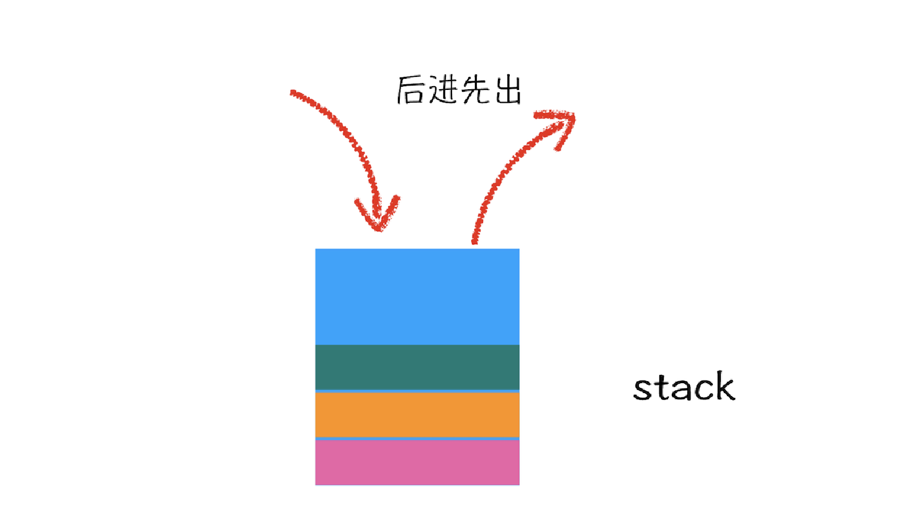
如下代码：
```js
var a = 2;
function add (b, c) {
    return b + c;
}
function addAll(b, c) {
    var d = 10;
    var result = add(b, c);
    return a + result + d;
}
addAll(3, 6);
```
代码执行解析：
1. 第一步创建全局上下问，并将其压入栈底。
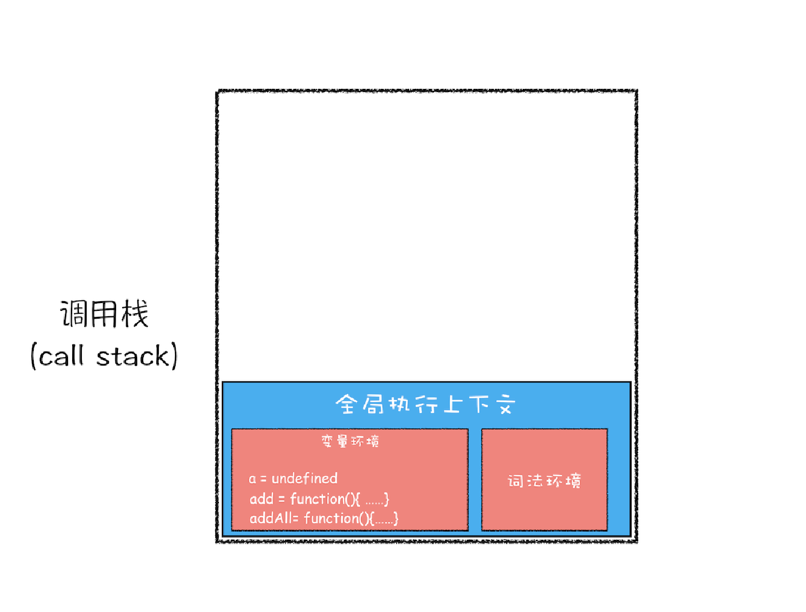
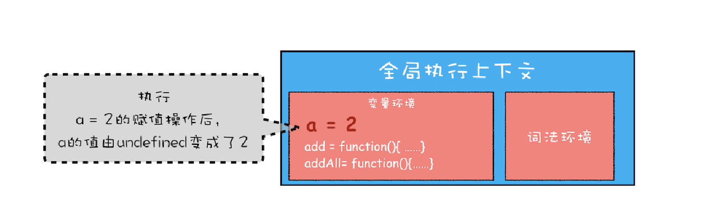
2. 第二步调用addAll函数
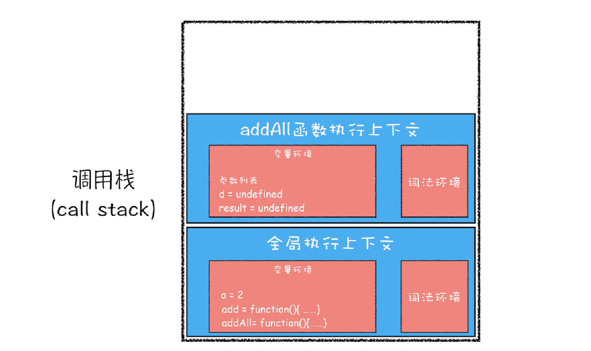
3. 第三步执行到add函数
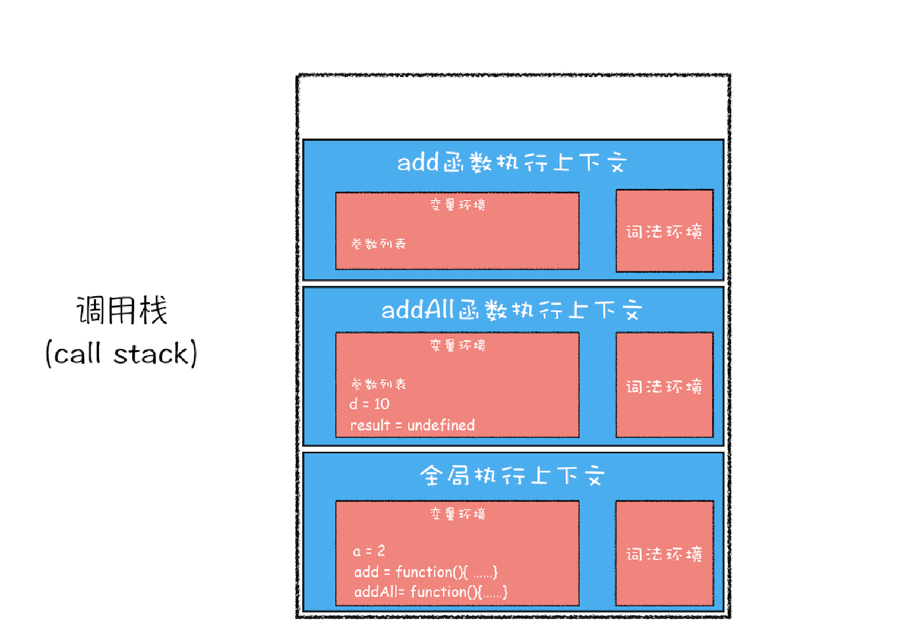
4. 执行完add函数
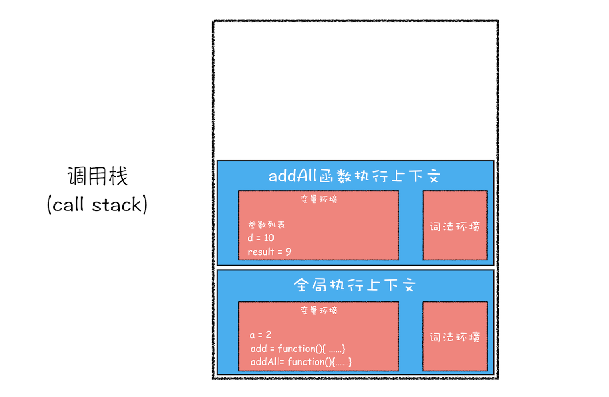
5. 执行完addAll函数
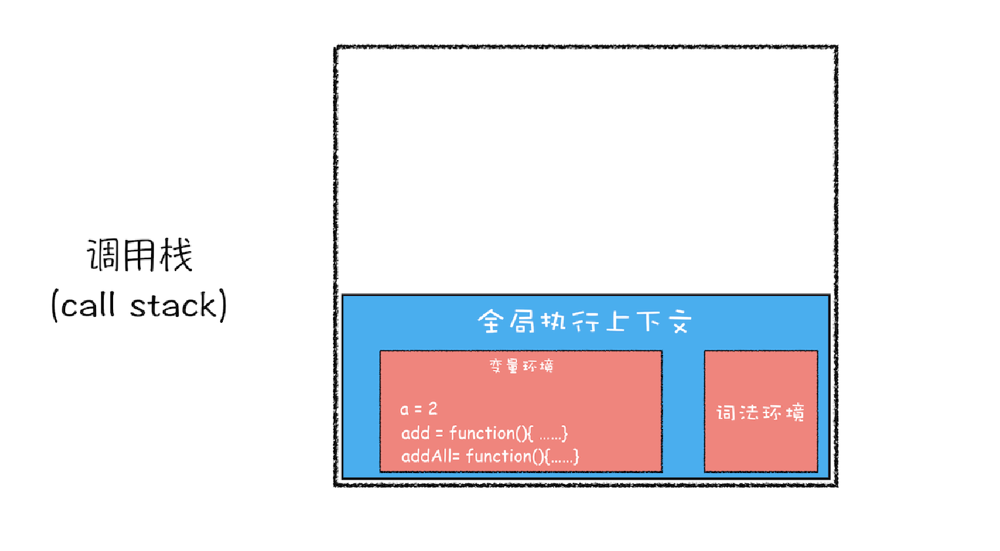
## 四、执行上下文的创建
主要有两个阶段：<b>创建阶段</b>和<b>执行阶段</b>
### 4.1 创建阶段
执行上下文创建阶段主要有三件事情：
1. 绑定this
2. 创建词法环境(LexicalEnvironment)
3. 创建变量环境(VariableEnvironment)

代码表示：
```js
ExecutionContext = {
    // 确定this的值
    ThisBinding = <this value>,
    // 创建词法环境组件
    LexicalEnvironment = {},
    // 创建变量环境组件
    VariableEnvironment = {},
};
```
#### 4.1.1 `this`绑定
在全局执行上下文中，`this`指向全局对象，浏览器环境下，指向`window`<br/>
在函数执行上下文中，`this`的值取决于该函数是如何被调用的。如果它被一个引用对象调用，那么`this`会被设置成那个对象，否则`this`的值被设置为全局对象或者`undefined`（严格模式下）

#### 4.1.2 词法环境
我们知道，ES5中只有全局作用域和函数作用域，直到ES6引入了`let`和`const`才有了块级作用域的概念，JS为了加入块级作用域的概念，从而引入了词法环境，简单的理解：`var`声明的变量和函数存放在变量环境，`let`/`const`声明的变量和函数放在词法环境。
#### 4.1.3 变量环境
变量环境也是一个词法环境。他具有词法环境中所有的属性 在ES6中，`LexicalEnvironment`和`VariableEnvironment`的区别在于前者用于存储函数声明和变量`let` 和 `const` 绑定，而后者仅用于存储变量 `var` 绑定。
```js
function foo() {
    var a = 1;
    let b = 2;
    {
        let b = 3;
        var c = 4;
        let d = 5;
        console.log(a);
        console.log(b);
    }
    console.log(b);
    console.log(c);
    console.log(d);
}
foo()
```
1. 编译并执行上下文
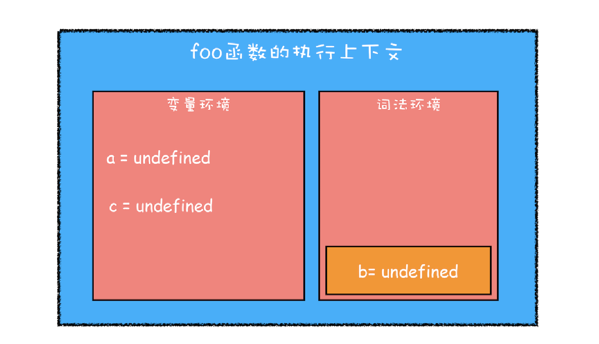
2. 继续执行代码
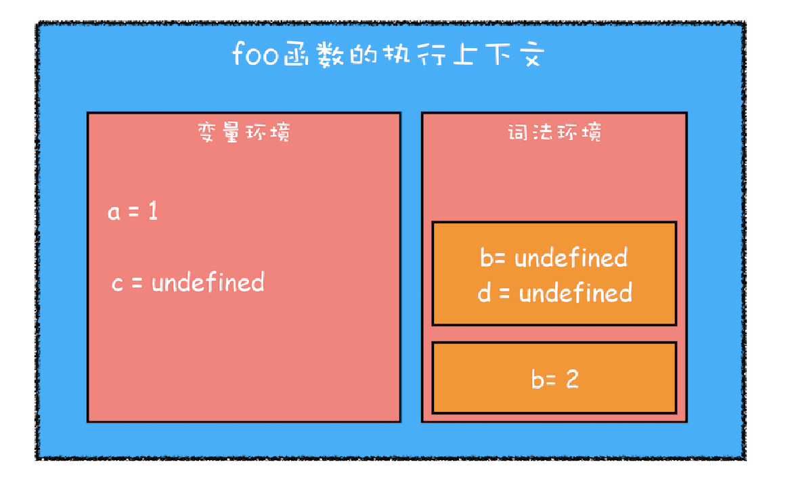
3. 变量查找过程
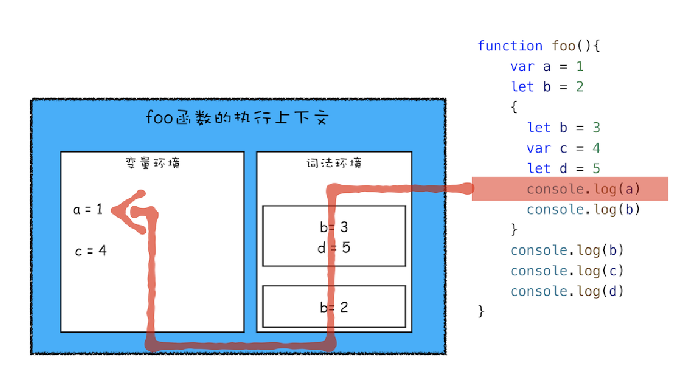
4. 最终执行上下文
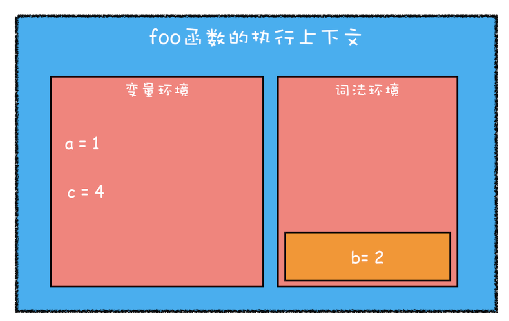
### 4.2 执行阶段
完成对所有这些变量的分配，最后执行代码。
如果 `JavaScript` 引擎 `let` 在源代码中声明的实际位置找不到变量的值，那么它将分配给它的值 `undefined` 。

:::tip
总结：
1. 全局执行上下文在代码执行的时候就会创建，一般由浏览器创建，并且一个程序只有一个全局上下文
2. 函数执行上下文在函数调用的时候被创建，可以存在多个
3. 调用栈是一个后进先出的栈结构
4. 变量环境包含词法环境的所有功能，区别就是：`let`和`const`声明的存放在词法环境，`var`声明的存放在变量环境
:::