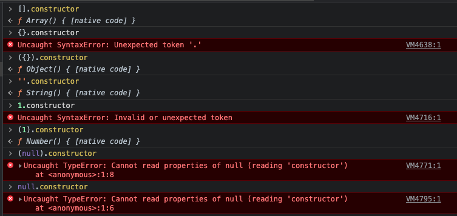

# JavaScript常用的判断类型的方法

## 一、typeof
**返回值是字符串**
```js
let aa = '1';
typeof aa => 'string'；

let bb = 1;
typeof bb => 'number'；

let cc = {}
typeof cc => 'object'；

let dd = []
typeof dd => 'object'；

let ee = null
typeof ee => 'object'；

let ff = function(){}
typeof ff => 'function'；
```
:::tip
缺点：
1. 不能判断对象的类型。因为{}、[]、null判断出来的都是"object";
:::
## 二、constructor
**判断这个变量是怎么构造出来的。**

## 三、instanceof
**判断谁是谁的实例。**
通过__proto__
## 四、Object.prototype.toString.call()
**推荐**
