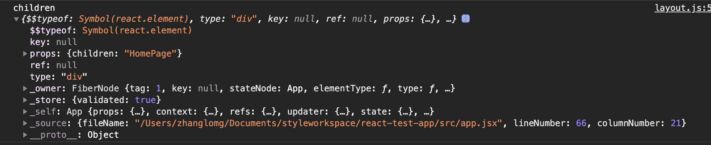

# React基础学习
[React官方文档](https://react.docschina.org/) <br/>
[React学习总结](https://www.yuque.com/hmohvc/tcttnf/lq9ya6)
## 一、组件传值
### 1、父组件向子组件传值
传递规则：通过props
```js
// 父组件
import React from 'react'
import Child from "./child";
export default class Partent extends React.Component {
    render() {
        return (
            <div>
                <Child msg="我是父组件的数据"/>
            </div>
        )
    }
}
```
```js
// 子组件
import React from 'react'

export default class Partent extends React.Component {
    render() {
       return (
            <div> {this.props.msg} </div>
       )
    }
}
```
:::tip
📢注意：<br/>
- render中必须要return出来html元素
- render中的return只能有一个根元素
- 如果props传值之后，在子组件中进行了state的初始化操作，这个时候父组件的值变化之后，子组件不会变化
:::

### 2、子组件向父组件传值
```js
// 子组件
import React from 'react'

export default class Partent extends React.Component {
    handleClick = () => {
        console.log(this.props);
        this.props.getChildData('我是子组件的数据');
    }
    render() {
       return (
            <div>
                {this.props.msg}
                <button onClick={this.handleClick.bind(this)}>点击给父组件传值</button>
            </div>
       )
    }
}
```
```js
// 父组件
import React from 'react'
import Child from "./child";
export default class Partent extends React.Component {
    state = {
        mess: '111'
    }
    getChildData = (msg) => {
        console.log(msg);
        this.setState({
            mess: msg
        });
    }
    render() {
        return (
            <div>
                <Child msg="我是父组件的数据" getChildData={this.getChildData.bind(this)}/>
                { this.state.mess }
            </div>
        )
    }
}
```
:::tip
📢注意：<br/>
- 子组件通过this.props调用父组件的方法，一定要记着把父组件的这个方法传递给子组件
:::
### 3. 如何对props进行限制
## 二、组件
### 1、`class`组件
`class`组件通常<b>拥有状态和生命周期，继承于`Component`</b>，实现`render`方法.
类中的方法默认开启局部的严格模式。
```js
// 1. 创建类式组件
class MyComponent extends React.Component {
  render() {
    // render 是放在哪里的？MyComponent 的原型对象上供实例使用。
    // render 中的 this 是谁？MyComponent 的实例对象 = MyComponent组件实例对象
    console.log('render中的this', this)
    return <h2>我是用类定义的组件（适用于【复杂组件】的定义）</h2>
  }
}
// 2. 渲染组件到页面
ReactDOM.render(<MyComponent/>, document.getElementById('test'));
```
:::tip
执行了 `ReactDOM.render(<MyComponent/>...` 之后，发生了什么？<br/>
1. `React` 解析组件标签，找到了 `MyComponent` 组件。
2. 发现组件是使用类定义的，随后 `new` 出来该类的实例，并通过实例调用到该原型上的 `render` 方法。
3. 将 `render` 返回的 虚拟DOM 转为 真实DOM，随后呈现在页面中。
:::
### 2、function组件
函数组件一般用于简单的的组件，因为函数组件中的`this`指向`undefined`;
原因：因为`babel`编译后开启了严格模式。
```js
// 1. 创建函数式组件
function MyComponent() {
  // 此处的 this 是 undefined，因为 babel 编译后开启了严格模式。
  console.log(this);
  return <h2>我是用函数定义的组件（适用于【简单组件】的定义）</h2>
}
// 2.渲染组件到页面
ReactDOM.render(<MyComponent/>, document.getElementById('test'));
```
:::tip
执行了 `ReactDOM.render(<MyComponent/>...` 之后，发生了什么？<br/>
1. `React` 解析组件标签，找到了 `MyComponent` 组件。
2. 发现组件是使用函数定义的，随后调用该函数，将返回的 虚拟 DOM 转为 真实DOM，随后呈现在页面中。
:::
在没有`hooks`之前，`function`组件只是作为一些简单的展示组件，如果有复杂的逻辑，还是需要使用`class`组件，出现`hooks`之后，也可以在`function`组件中保存状态，实现一些复杂的逻辑。
```js
import React, { useState, useEffect } from 'react'

export function FunctionComponent(props) {
  const [date, setDate] = useState(new Date());
  useEffect(() => { // 类似componentDidMount

  })
	return (
  	<div>FucntionComponent</div>
  )
}
```
### 3、组件复合
将多个组件合并到一个模板中，通过模板传参的方式，判断渲染哪些组件。
```js
// HomePage
import Layout from './layout'
class App extends React.Component {
	render() {
  	return (
    	<div>
      	<Layout>
      		<div>HomePage</div>
      	</Layout>
      </div>
    )
  }
}
```
```js
// Layout
import React, { Component } form 'react'
export default class Layout extends Component {
	render () {
  	const { children } = this.props;
    console.log("children", children)
    return (
    	<div>
      	<h3>header</h3>
      	{this.props.children}
      	<h3>footer</h3>
      </div>
    )
  }
}
```

这样就类似Vue的插槽
### 4、简单组件和复杂组件的定义
- 有状态`(state)`的组件，就是复杂组件
- 一般简单的组件只接收参数，渲染页面，不会维护自己的`state`
### 5、受控组件和非受控组件
解析：<br/>
受控组件，是受到`state`的控制。意思就是输入数据的时候，直接存到`state`中，当使用的时候，直接从`state`中取；<font color="red">（页面中所有输入类的dom(输入框)，随着输入，就能把数据维护到state中，等需要用的时候，直接从state中取出来）</font> <br />
非受控组件，就是不收任何控制，直接把数据存到自身，然后现用现取。非受控组件需要使用`ref`，`react`官网不建议多次使用`ref`
## 三、`state/setState`

## 四、生命周期
